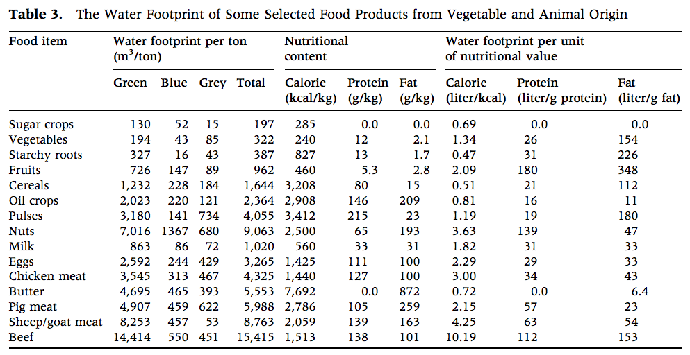
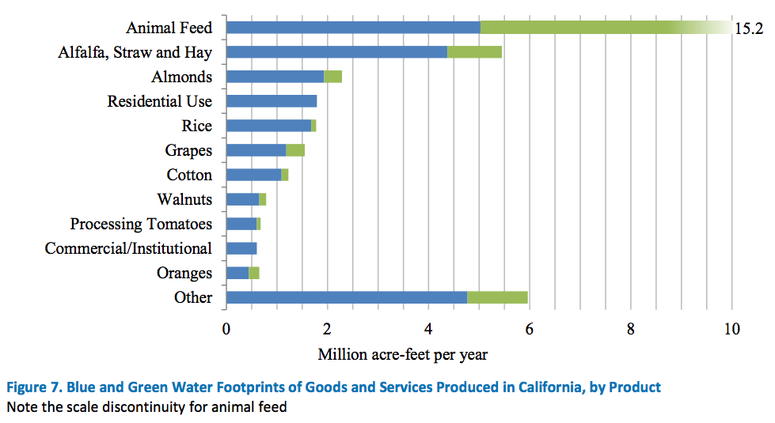

```{r libraries, echo=FALSE, message=F}
require(knitr)
library(data.table)
library(ggplot2)
library(jsonlite)
library(curl)
library(plyr)
library(rCharts)
library(psych)
library(xtable)
#library(printr)
load("water_footprint_table.RData")
```


```{r interactive_CA, echo = FALSE, fig.path="", results = "asis", comment=NA}
require(rCharts)
w2 <- nPlot(CA_L_per_100g ~ protein, 
            group = 'kingdom',  name = 'Source',
            data = na.omit(water), 
            type = 'scatterChart')
w2$chart(color = c("green", "darkred")) 
w2$chart(tooltipContent =   "#! function(key, x, y, e){ 
                                return e.point.Products
                            } !#")
w2$set(title = "Water Footprint vs. Protein: California")
w2$xAxis(axisLabel = 'Protein (%)')
w2$yAxis(axisLabel = "Water Footprint: California (L/100g)" )
w2$chart(showControls = F)  ## turn off stupid magnify.
w2                                 ## works in RStudio
#w2$show('iframe', cdn = TRUE)       ## works in RStudio
#w2$show('iframesrc', cdn = TRUE)   ## works in shiny-server
``` 

#### Figure 1 (Interactive): Water Footprint vs. Protein: California

****

You've probably heard by now that there's a [severe drought](http://en.wikipedia.org/wiki/Climate_change_in_California#Drought) in California, and that governor Jerry Brown has [ordered](http://www.waterboards.ca.gov/waterrights/water_issues/programs/drought/docs/040115_executive_order.pdf) a 25% reduction in city water usage. You've probably also heard that 80% of [California's water](http://www.sacbee.com/opinion/op-ed/soapbox/article17332904.html) is used by agriculture, and that some crops, [famously almonds](http://www.motherjones.com/environment/2015/01/california-drought-almonds-water-use), require a disproportionally large amount of water to grow, which is to say, they have a large *water footprint*.

Others have argued that the water footprint of almonds really [isn't so bad](http://gizmodo.com/seriously-stop-demonizing-almonds-1696065939) compared to meat and to fodder crops for that meat. 

But do almonds or beef really have disproportionate water footprints if you consider the nutrition or energy they provide? Yes.

# Why Protein?

All known lifeforms depend on water, and most require quite a lot of water. The water is necessary for photosynthesis and respiration, and for metabolic activities, such as monomerization, the building of the basic molecules (amino acids, carbohydrates, lipids) which make up our mass and structure.

The Calorie is the unit of energy that we like to use for food. The energy we get from food takes the form of fats, carbohydrates, and proteins (the polymers built up from their respective basic molecules). In one sense, the calorie is a good summary measure of how useful a food is to you. All else being equal, it would be more efficient to eat something higher in calories. In much of the world, there is no short supply of cheap calories from fats and carbohydrates. But protein tends to be expensive.

If we can assess the water footprint of foods controlling for their protein content, then we can get a good idea of what really is or isn't an efficient use of agricultural water for the stuff we eat.

# What is a Water Footprint?

The studies we have of water footprints mostly come from the UNESCO-IHE Institute for Water Education in the Netherlands, as well as the Pacific Institute in Oakland, California. The water footprint is the measure of *virtual water*, a concept introduced by British geologist John Allan, which refers to the sum of water used in the production and trade of commodities. If 1000 liters were used to produce a thing, that thing contains 1000 liters of virtual water.

Arjen Hoekstra and Mesfin Mekonnen at the UNESCO-IHE measure three types of virtual water. The *blue water footprint* refers to the ground water used to produce a product, the *green water footprint* refers to the rain water used, and the *grey water footprint* is the volume of water that is required to dilute all of a product's pollutants (fertilizers, pesticides, etc.) to such an extent that the quality of the water remains at or above legal standards.

For the animal sourced foods, the UNESCO-IHE studies also separate out four categories of farming systems: grazing, industrial, a mix of those two, and a weighted average. For plant sourced foods, the studies are sourced nationally as well as by state, province, or region; the animal source studies are sourced just by nation.

# What we did.

In this study, we look at the UNESCO-IHE water footprint data (for California and a global average) with nutrition data from the USDA National Nutrient Database. We used only the weighted average farming system, and we used just one total water footprint, the sum of those three. We've paired down the UNESCO-IHE studies to 48 plant sourced foods (38 in California) and 11 animal sourced foods.

# What we found.

The water footprint of a food strongly correlates positively with its protein content. What is also interesting is that, controlling for protein, animal sourced foods do not stand out from plant sourced foods. 

So yes, meats and nuts have amazingly high water footprints, and beef and almonds are outliers at the very top. In California, beef takes 75 liters of water for each gram of protein it has. At 21% protein that's 1,575 liters of water for just 100 grams of raw beef. (That's 400 gallons for just 3.5 ounces.) Almonds, also 21% protein, are almost as thirsty, requiring 62 liters per gram of protein -- 1,300 liters for 100 grams of almonds.
1/2 lb hamburger: 840 gallons
1/2 lb almonds: 780 gallons
Even less water efficient are walnuts, garbanzo beans, and hazelnuts. Hazelnuts require 115 liters of water for each gram of protein they provide. 

# Low Water Foods. 

Despite the strong trend of higher protein foods having higher water footprints, we can still find high protein foods that buck the trend and are unusually efficient in their water use.

Here are two lists of the least water intensive foods, one list for California grown foods, and one from a global average. I've ordered it by the second column, which shows the amount of water (in liters) used to produce just one gram of protein in that food.

##### Tables 1 & 2: Water Efficient Foods produced in California and by global average.
<table style="width:100%";>
<tr><td width='50%'>
```{r table_protein_CA, echo=F, eval=T, results='asis'}
require(xtable)
setkey(water, CA_L_per_g_protein)
CA_adjfp_prot_low <- xtable(head( na.omit(water[,.( Food=Products, "L/g Protein"=round(CA_L_per_g_protein), "% Protein"=round(protein) )]),10 ),align=c('c','c','c','c'))
kable(CA_adjfp_prot_low, format = "html", caption = "Table 1: California")
```
</td>
<td>
```{r table_protein_global, echo=F, eval=T}
require(xtable)
setkey(water, G_L_per_g_protein)
Gl_adjfp_prot_low <- xtable(water[1:10,.( Food=Products, "L/g Protein"=round(G_L_per_g_protein), "% Protein"=round(protein) )],align=c('c','c','c','c'))
kable(Gl_adjfp_prot_low, format = "html", caption = "Table 2: Global Average")
```
</td></tr>
</table>  
</br>

A few high protein foods already stand out as being unusually water efficient: poultry and eggs in California (Table 1), and Brazil nuts and oats in the global list (Table 2). All four are interesting exceptions. We'll discuss Brazil nuts further on. The percent of protein in oats should probably be reduced by half because it needs twice its mass in water to be edible. But still, getting 8 $\frac{1}{2}$ grams of protein by eating 100 grams of oatmeal that consumed 120 liters of water to grow isn't bad. Poultry and eggs are immediate winners as far as water efficiency per protein, but because we already consume so much of them, they actually represent a large amount of agricultural water. Compared to beef and nuts, they're much more water efficient.

The most water efficient proteins on the lists are from garlic, spinach, and brussel sprouts. But these have low percentages of protein, so you would have to eat a lot of them, and you could, but most of us don't. 

The big advantage of high protein foods (meats and nuts) is that we can eat a lot less of them, which makes life easier. For example, if you eat just 100 grams (3.5 ounces) of turkey, you'll get 20 grams of protein. To get 20 grams of protein from spinach, you would need to eat a kilogram (2.2 pounds). But the 160 virtual liters of water in a kilo of spinach is still less than the 220 liters in 100 grams of turkey -- 60 liters less. It sounds like an enourmous amount of spinach to eat in one sitting, but not unreasonably so. There are [vegan athletes](http://www.greatveganathletes.com/) who do eat these quantities of fruits and vegetables.  

# Low Water; High Protein.

The most water efficient diet would probably be plant-based and would exclude nuts. That diet might involve a lot of green smoothies and expensive plant-sourced protein powders, and would be a big challenge for most of us.

Let's look at the most water efficient amongst foods that have a decent protein content. In these two tables, we've filtered out foods with less than ten percent protein. Again, it's sorted by liters of water per gram protein.

##### Tables 3 & 4: High Protein, Water Efficient Foods produced in California and by global average.
<table style="width:100%";>
<tr><td>
```{r table_protein_CA_10, echo=F, eval=T, results='asis'}
require(xtable)
setkey(water, CA_L_per_g_protein)
CA_adjfp_prot_10 <- xtable(head(na.omit( water[protein>10,.( Food=Products, "L/g Protein"=round(CA_L_per_g_protein), "% Protein"=round(protein) )] ),8),align=c('c','c','c','c'))
kable(CA_adjfp_prot_10, format = "html", caption = "Table 3: California")
```
</td>
<td>
```{r table_protein_global_10, echo=F, eval=T}
require(xtable)
setkey(water, G_L_per_g_protein)
Gl_adjfp_prot_10 <- xtable(head(water[protein>10,.( Food=Products, "L/g Protein"=round(G_L_per_g_protein), "% Protein"=round(protein) )],8), align=c('c','c','c','c'))
kable(Gl_adjfp_prot_10, format = "html", caption = "Table 4: Global Average")
```
</td></tr>
</table>

# Brazil Nuts

The most water efficient food in this dataset is the Brazil nut, which is definitely an outlier. It's water footprint of 2 liters per gram protein is so low that it seems suspicious. All the other nuts have extraordinarily high water footprints. There's no biological reason the Brazil nut should be so water efficient; the reason perhaps is in its method of production. Brazil nuts are unique in that they are gathered from existing trees rather than from plantations. The existing infrastructure of old trees means that ground water needn't be diverted to grow a tree first, and therefore needn't be included (or just isn't measurable) in an accounting of the water footprint. Of course if everyone started eating tons of Brazil nuts, then they'd have to start growing more trees which would likely have a very high water footprint.


# Comparison of Water Footprints: California vs. Global Average 
```{r diffs, echo=F, eval=F}
differences <- na.omit((water[, .(Products, 
                         difference=(California_footprint-Global_avg_footprint),
                         California_footprint, Global_avg_footprint)]))
differences$abs=abs(differences$difference)
setkey(differences,abs)
differences <- differences[order(-abs)]
head(differences,15)
nrow(differences)

library(reshape2)
diff.long<-melt(head(differences,10), id=c("Products","difference"), measure=c("California_footprint","Global_avg_footprint"))

d1 <- ggplot(diff.long, aes(x=reorder(Products,-difference),value,fill=variable)) +
geom_bar(stat="identity",position="dodge")
d1 <- d1 + labs(y=expression("Water Footprint ("*m^3/ton*")"), x = "")
d1 <- d1 + theme(axis.title=element_text(face="bold.italic", 
   color="brown"), legend.position="top")
d1 + guides(fill = guide_legend(title = NULL))

#ggplot(diff.long, aes(x=reorder(Products,-difference),value,fill=variable))+
#geom_bar(stat="identity",position="dodge") +
#coord_flip() + geom_text(aes(x=reorder(Products,-difference), `value`, label = sprintf("%2.0f", `value`), y=(`value`)*1.02+900, ymax=max(`value`)*1.05), position = position_dodge(width=1))
ggsave("differences.svg", width=8)
```


##### Figure 2: Comparison of 10 Differing Water Footprints: California vs. Global Average.

This plot shows vastly differing water footprints of some foods grown in California versus a global average. Garbanzo beans (chickpeas) stand out as being ridiculously thirsty in California, but quite water efficient elsewhere. On the other hand, pistachios seem to have a relatively low water footprint in California.

# About the Data.

A couple of caveats about this data. The water footprint is calculated for raw foods. Raw meat has more fat and water than cooked meat, and therefore has less protein by mass. Raw lentils and beans are dry and have much more protein by mass than when they are actually edible. (The extra few liters it takes to clean and cook the beans is negligable though.) There are many different proteins made from combinations of amino acids, nine of which our bodies can't make. We call those nine the essential amino acids, and foods that have those nine are said to have a complete protein. Monocots (like rice and corn) and dicots (like beans and lentils) complement each other's amino acids to form a complete protein. (By the way, your cells store them up, so you don't even have to eat them at the same meal!) The advantage of animal sourced food is that it always has complete proteins. Some plants do too though -- quinoa is famous for that. But nevermind that, we're not counting the completeness of proteins here, just the overall quantity.

# Protein Values in the UNESCO-IHE Report.

In Mekonnen and Hoekstra's 2012 report, __The Green, Blue and Grey Water Footprint of Farm Animals and Animal Products__, they provide their own table of water fooprints versus protein:

#### Table 5: Excerpted "Table 3" from Mekonnen & Hoekstra's 2012 report.
 

<!--
<iframe src="./mekonnen_2012_table3.small.html" width="100%" frameborder= "0" class="myIframe">
<p>http://waterfootprint.org/media/downloads/Mekonnen-Hoekstra-2012-WaterFootprintFarmAnimalProducts.pdf</p>
</iframe>

<script type="text/javascript" language="javascript"> 
$('.myIframe').css('height', $(window).height()*0.6+'px');
</script>
-->   
   
But their levels of protein seem unusually low.

The proportion of protein that we used was obtained by taking the median of just the raw products from the USDA list. 
Choosing only raw foods seemed reasonable because the water footprint reports don't mention anything as cooked, which seems reasonable. The USDA nutrition numbers for cooked (or otherwise prepared) foods have a  higher variance than raw foods. The raw value has its own bias of course. Primarily, legumes (or pulses) which must be soaked to be eaten have a much higher proportion of protein when dry. Choosing raw nutrients levels seems to make the most sense for most foods. Cooked meats have much higher protein levels than raw meats because much of the water and fat is evaporated.

**Table 6: Comparison of the protein content of beef.**

beef protein averages (%) | raw      | cooked or raw   
--------------------------|----------|--------
median                    | 20.69    | 24.24 
mean                      | 19.97    | 24.37

The Mekonnen-Hoeksta report lists a value of 138 g/kg (or 13.8%) of protein for beef, which seems low compared to the USDA analysis. A low protein estimate results in a high estimate for the water footprint per protein.

**Table 7: Comparison of Water/Protein Rates (L/g protein)**

Product     | Franklin  | Mekonnen
------------|-----------|------------------
Beans       |  24       |  19
Chicken     |  23       |  34
Lentils     |  25       |  19
Eggs        |  25       |  29
Milk        |  30       |  31
Pork        |  30       |  57
Pistachio   |  56       | 139
Beef        |  75       | 112
Almonds     |  76       | 139
Butter      | 274       |   0

There general conclusion, "that from a freshwater resource perspective, it is more efficient to obtain calories, protein and fat through crop products than animal products", seems not to hold up. Poultry and eggs are amongst the most water efficient sources of protein in their study, while both beef and nuts are terribly inefficient.

However, when we take the sheer quantity of food produced into account, as Pacific Institute has done, we find that the *total production of* animal sourced food has a much higher water footprint than that of plant sourced foods. Though nuts have comparably high water footprints, we consume ten times more meat and dairy, so the overall water footprint of meat and dairy production just dwarfs that of nuts. 

## Will avoiding foods that have a high water footprint (meat and nuts) meaningfully affect California's agricultural water use?  



#### Figure 3: Excerpted "Figure 7" from Fulton, Cooley, Gleick 2012.
    
    
Almonds produced in California in 2013 amounted to 900 million kilograms (2 billion pounds). The water footprint was 2.63 billion cubic meters (2.13 million acre feet) -- about the same volume as Mount Everest. (And that's not counting grey water.) Two thirds of those almonds were exported (USDA CA) (Pacinst). If Americans stopped eating almonds, we can assume that would have some effect economically. Perhaps the price would drop. Perhaps that one third domestic portion of almonds would be exported as well. Or perhaps production would be reduced.

If production of almonds for domestic use was reduced to zero for a year, that would save about 876 million cubic meters of water. It would be enough to refill California's second largest resevoir, Lake Oroville, to a normal level (water.ca.gov). In comparison, the mandatory water reduction in Californian cities amount to a savings of 1.85 billion cubic meters (1.5 million acre feet) over nine months (water.ca.gov). A one-third reduction in  almonds would save half of the total amount saved by the mandatory water reduction. In 2013, the almond crop was valued at $5.77 billion.

Animal products are actually a much, much bigger contributer to California's water footprint. California's production of "animal feed" as well as "Alfalfa, Straw, and Hay" (which is used as roughage in animal feed but counted separately because of a difference in imports/exports) account for about 26 billion cubic meters (21 million acre feet) of water (not counting grey water) or ten Mount Everests of water (pacinst).

About 1.6 billion cubic meters (1.3 million AF) of meat and dairy products and 1.2 billion cubic meters (1 million AF) of alfalfa, straw, and hay are exported internationally (pacinst). California is actually an importer of animal feed. Apparently that enormous water footprint represents *not enough* animal feed (pacinst 18). There is a huge amount of Californian meat and dairy products that are exported and imported, both nationally and internationally, so it's less easy to estimate the possible amount of water that would be saved by refraining from meat. Suffice to say, it's hard to look at those plots and not think about taking an extra long shower instead of eating a burger. As an omnivore, it just got a lot harder to mock the vegans.


Top California Commodities in 2013

Commodity           | Weight (short tons)   | Value (US$)     | rank
--------------------|-----------------------|---------------|-------
Milk and Cream      | 20,630,000            | 7,617,641,000 | 1
Almonds (shelled)   |  1,005,000            | 5,768,100,000 | 2
Grapes              |  7,717,000            | 5,585,584,000 | 3
Cattle & Calves     |  1,020,000            | 3,048,390,000 | 4
Strawberries        |  1,378,000            | 2,200,729,000 | 5
Walnuts             |    492,000            | 1,795,800,000 | 6
Lettuce             |  2,987,700            | 1,679,164,000 | 7
Hay, Alfalfa, etc   |  7,956,000            | 1,569,780,000 | 8
Tomatoes            | 12,520,000            | 1,222,470,000 | 9
Nursery             | NA                    | 1,219,800,000 | 10
corn for grain      |    982,800            |   194,805,000 | 32
beans, dry          |     57,500            |    61,410,000 | 49

Regarding chicken, the report says this:  
"No value for 2013 Chickens, All due to USDA ERS confindetiality procedures."  
As for poultry data:  
"Withheld to avoid disclosing data for individual farms."


****

Correlations

```{r pairs, echo=F, comment=F, warning=F, error=F, eval=F}
require(psych)
svg(file="water_pairs.svg", width = 8)
par(mfrow = c(1,1))
pairs.panels( water[,c(3:8),with=F], smooth=T, ellipses=F, cor=T,
      main = "Water Footprint Correlations: Global Average", pch=21, 
      bg = 2 + (as.numeric(water$kingdom) < 2)) ## color: red=2,green=3, plant=1,animal=2
dev.off()
```


# Footprint vs. Protein


```{r interactive, echo = FALSE, fig.path="", results = "asis", comment=NA}
require(rCharts)
w2 <- nPlot(G_L_per_100g ~ protein, 
            group = 'kingdom',  name = 'Source',
            data = water, 
            type = 'scatterChart')
w2$chart(color = c("green", "darkred")) 
w2$chart(tooltipContent =   "#! function(key, x, y, e){ 
                                return e.point.Products
                            } !#")
w2$set(title = "Water Footprint vs. Protein: Global Average")
w2$xAxis(axisLabel = 'Protein (%)')
w2$yAxis(axisLabel = "Water Footprint: Global Average (L/100g)" )
w2$chart(showControls = F)  ## turn off stupid magnify.
w2                                  ## RStudio; not Shiny-server
#w2$show('iframe', cdn = TRUE)      ## RStudio; not Shiny-server
#w2$show('iframesrc', cdn = TRUE)   ## not RStudio; shiny-server
```


```{r plot_pro_v_foot, echo=F, results='asis', fig.height=6, fig.width=8, eval=F}
### protein vs global_avg_footprint
### NON-interactive
w1 <- ggplot(data=water, aes(y = G_L_per_100g, x = protein, color=kingdom)) +
        geom_point(data = subset(water, protein <= 3 & G_L_per_100g <= 300))
w1 <- w1 + scale_color_manual(breaks = c("plant", "animal"),
                              values=c("darkred", "green4"),
                              name= "Source")
w1 <- w1 + geom_smooth(data = water, method="lm", fullrange=TRUE)
w1 <- w1 + geom_text(aes(label=ifelse(
                                protein > 3 |
                                G_L_per_100g > 300,
                                Products,'')),
                     hjust=0,just=0, size=3,
                     position = position_jitter(w = 0.5, h = 15),
                     show_guide = F)
w1 <- w1 + labs(y=expression("Water Footprint: Global Average (L/100g)"),
            x = "Protein (%)", title="Water Footprint vs. Protein of Raw Foods: Global Average")
w1 <- w1 + theme(axis.title=element_text(face="bold.italic",
   color="brown"), legend.position="top")
w1 <- w1 + scale_y_continuous(breaks=seq(0,2200,200))
#w1 <- w1 + expand_limits(y = c(0, 17500), x = c(0, 30) )
ggsave("prot_Global.svg", width=10, height=8)
ggsave("prot_Global.pdf", width=8)
```
<!-- The jitter function shifts the data points to reduce overlap.
    Because it uses randomness, I ran it a few times and chose the clearest version.-->

<!---->
<!---->


# Footprint vs. Protein: California
```{r plot_pro_v_foot_CA, comment=F, echo=F, results='asis', fig.height=6, fig.width=8, eval=F}
### protein vs global_avg_footprint
### NON-interactive
w1 <- ggplot(data=na.omit(water), aes(y = CA_L_per_100g, x = protein, color=kingdom)) +   
        geom_point(data = subset(na.omit(water), protein <= 3 & CA_L_per_100g <= 300, na.omit=T)) 
w1 <- w1 + scale_color_manual(breaks = c("plant", "animal"), 
                              values=c("darkred", "green4"),
                              name= "Source")
w1 <- w1 + geom_smooth(data = na.omit(water), method="lm", fullrange=TRUE)
w1 <- w1 + geom_text(aes(label=ifelse(
                                protein > 3 | 
                                CA_L_per_100g > 300, 
                                Products,'')), 
                     hjust=0,just=0, size=3,
                     position = position_jitter(w = 0.5, h = 15),
                     show_guide = F)
w1 <- w1 + labs(y=expression("Water Footprint: California (L/100g)"), x = "Protein (%)", title="Water Footprint vs. Protein of Raw Foods in California")
w1 <- w1 + theme(axis.title=element_text(face="bold.italic", 
   color="brown"), legend.position="top")
w1 <- w1 + scale_y_continuous(breaks=seq(0,2200,200))
#w1 <- w1 + expand_limits(y = c(0, 2000), x = c(0, 30) )
ggsave("prot_US_CA.svg", width=10, height=8)
#ggsave("prot_US_CA.pdf", width=8)
```
<!-- The jitter function shifts the data points to reduce overlap.
    Because it uses randomness, I ran it a few times and chose the clearest version.-->

<!---->
  


****

<!--


http://www.nass.usda.gov/Statistics_by_State/California/Publications/California_Ag_Statistics/CALivestockandDairy.pdf
dairy p7
cheese 2,313,000,000 lbs
yogurt 620,171,000 lbs in 2009
milk 41.3 billion lbs  44.2% went to cheese (dairy 2013: $7,617,641,000)
cream 185,664,000 + 127,508,000
eggs 5.05 billion
cattle and calves live 2,039,468,000 lbs    $3,059,175,000
sheep and lambs live 45,791,000 lbs         $   67,182,000 2010
hogs and pigs live 47,708,000 lbs           $   41,556,000
turkey meat 365,300,000 lbs 

if all the cattle were used for beef that would be
beef 
14141 m3/m.ton * 2039468000 lbs = 13.08 billion m3 = 10.6 million acre feet. 

hay, alfalfa: 
15.2 million acre feet / 7,956,000 short tons = 2.598 m3/kg = 2598 m3/ton = 259.8 L/100g
That seems reasonable; it's close to what rice is.


meat animals 2013 $3,088,751,000

Discuss where this data comes from, and how they are missing alfalfa (even though people do eat alfalfa) and other fodder crops (hay). Show quote where the researchers explain that they're including fodder in their meat estimates.

"The water footprint of a live animal consists of
different components: the indirect water footprint
of the feed and the direct water footprint related to
the drinking water and service water consumed. . . The water footprint of an animal related to the
feed consumed consists of two parts: the water
footprint of the various feed ingredients and the
water that is used to mix the feed."

http://waterfootprint.org/media/downloads/Mekonnen-Hoekstra-2012-WaterFootprintFarmAnimalProducts.pdf pp2-3 (pp402-3 as labeled) 

*****
Total outputs of CAlifornia


In 2013, California produced approximately
7.96 million tons of alfalfa hay, valued at
$1.57 billion. 
--http://www.nass.usda.gov/Statistics_by_State/California/Publications/California_Ag_Statistics/CAFieldCrops.pdf page 13

****
2013: top CA commodities
Milk and Cream  $7,617,641,000  almost 21 percent of the nation's milk supply. Asian markets imported 53 percent of US dairy exports in 2013
Almonds         $5,768,100,000    99% of the nation
Grapes          $5,585,584,000    leads the nation
Cattle & Calves $3,048,390,000    
meat animal     $3,088,751,000


http://www.nass.usda.gov/Statistics_by_State/California/Publications/California_Ag_Statistics/CA_Ag_Overview.pdf

****
general source for CA 2013 yields: 
http://www.nass.usda.gov/Statistics_by_State/California/Publications/California_Ag_Statistics/index.asp

******

harvested roughages: include those which are sown and harvested annually for forage, fodder or silage. The principal types of
harvest roughages include forage (green) cereals such as maize, oats and sweet sorghum; sugarcane, lucerne (alfalfa) and berseem
(Egyptian clover); special high yielding grasses cultivated chiefly for silage (such as Thimoth grass); roots and tubers such as
potatoes, beets, swedes, turnips; oilseeds such as winter rape; pulses such as field peas, beans, sweet lupins and vetches;
vegetables such as pumpkins and cabbages. These feeds are sometimes processed for lower fibre content and bulk and are then
usually classified as concentrate feeds (e.g. cassava chips and pellets, processed alfalfa, pea and bean meals).  (p14)

The total feed consumption
over the period 1996-2005 was 4996 million ton feed in dry matter per year, on average. Roughages account for
the largest share out of this total, accounting for 80%, and feeds derived from crop production account for the
remaining 20%.  (p20)

http://waterfootprint.org/media/downloads/Report-48-WaterFootprint-AnimalProducts-Vol1.pdf

*****

#### Conversions:
#### 1000 cubic meters / metric ton
#### = 120 gallons / pound
#### = 26.4 gallons / 100 grams  
#### ~or~ 4000 m3/t = 100 gal / 100 g

## 1/2 lb hamburger: 14000 m3/t = 14*120/2 = 840 gallons
## 1/2 lb almonds:   13000 m3/t = 13*120/2 = 780 gallons

-->

These lines are _going to_ intersect<sup>1</sup>!

...

--------

**Footnotes:**

1. See Euclid's 5<sup>th</sup> postulate.

# Works Cited

Mekonnen, M.M. and Hoekstra, A.Y. (2010). The green, blue and grey
water footprint of farm animals and animal products. UNESCO-IHE Institute for Water Education. Retrieved May 2, 2015 from waterfootprint.org/media/downloads/Report-48-WaterFootprint-AnimalProducts-Vol1.pdf.

Mekonnen, M.M. and Hoekstra, A.Y. (2011). The green, blue and grey water footprint of crops and derived crop products, Hydrology and Earth System Sciences, 15(5): 1577-1600. Retrieved May 2, 2015 from waterfootprint.org/media/downloads/Mekonnen-Hoekstra-2011-WaterFootprintCrops.pdf.

Mekonnen, M.M. and Hoekstra, A.Y. (2012). A global assessment of the water footprint of farm animal products, Ecosystems, 15(3): 401–415. Retrieved May 2, 2015 from waterfootprint.org/media/downloads/Mekonnen-Hoekstra-2012-WaterFootprintFarmAnimalProducts.pdf.

U.S. Department of Agriculture, Agricultural Research Service. (2014). USDA National Nutrient Database for Standard Reference, Release 27. Nutrient Data Laboratory Home Page. Retrieved May 2, 2015 from ars.usda.gov/nutrientdata.

U.S. Department of Agriculture, National Agricultural Statistics Service. (2015). California Agricultural Statistics, 2013 Crop Year. Retrieved May 2, 2015 from nass.usda.gov/Statistics_by_State/California/Publications/California_Ag_Statistics/.

California Department of Water Resources. (2015). Water Conditions: Storms, Drought and California's Water Situation: Key Points. Retrieved May 2, 2015 from www.water.ca.gov/waterconditions/waterconditions.cfm.

Fulton, J., Cooley, H., & Gleick, P.H. (2012). Assessment of California’s Water Footprint. Pacific Institute. Retreived May 2, 2015 from http://pacinst.org/publication/assessment-of-californias-water-footprint/.

****

<a rel="license" href="http://creativecommons.org/licenses/by-sa/4.0/"></a><br />

This work is a reproducible document written in R and licensed under the Creative Commons Attribution-ShareAlike 4.0 International License. You can see all the code (use it and modify it) at [https://github.com/stephenfranklin/nutrientfootprint](https://github.com/stephenfranklin/nutrientfootprint).
To view a copy of this license, visit [http://creativecommons.org/licenses/by-sa/4.0/](http://creativecommons.org/licenses/by-sa/4.0/).